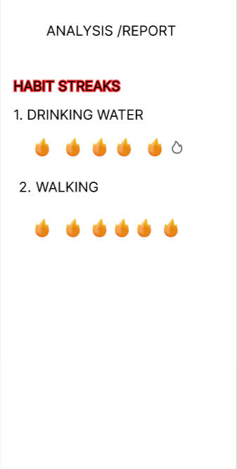

# 🚀 Habit Tracking System

## 📌 Overview
The **Habit Tracking System** is a web/mobile application designed to help users build and maintain productive habits. It enables users to track daily routines, set goals, monitor progress, and stay motivated through reminders and analytics.

## 🎯 Objective
- Help users develop consistent and healthy habits.
- Provide an intuitive interface for tracking and managing habits.
- Deliver progress analytics and visual reports.
- Send notifications and reminders for consistency.
- Enhance user engagement with streaks, rewards, and goal tracking.

---

## 🗺️ Navigation Pages
The Habit Tracking System consists of the following key sections:

1. **🏠 Home Page** – Overview of the application, features, and login/signup options.
2. **📊 Dashboard** – Displays active habits, progress summary, and streaks.
3. **➕ Habit Management** – Add, edit, or remove habits with custom reminders.
4. **📈 Analytics & Reports** – Provides insights, graphs, and streak analysis.
5. **⚙️ Settings** – Manage profile, preferences, and notifications.
6. **❓ Help & Support** – FAQs, troubleshooting, and customer support.

---

## ⚙️ Project Workflow
The development of the Habit Tracking System follows this structured workflow:

### **1️⃣ Planning & Ideation**
- Define the problem statement and goals.
- Identify key features and user requirement.

### **2️⃣ UI/UX Design**
- Create wireframes and prototypes.
- Ensure a smooth and intuitive user experience.

### **3️⃣ Frontend Development**
- Develop the user interface using **React/Flutter**.
- Implement responsive and interactive components.

### **4️⃣ Backend Development**
- Set up a **Node.js/Express.js** backend.
- Develop APIs for user authentication, habit tracking, and analytics.

### **5️⃣ Integration & Testing**
- Connect the frontend with the backend.
- Perform unit, integration, and UI testing.

### **6️⃣ Deployment & Maintenance**
- Deploy the application on a server.
- Regularly update and improve performance.

---

## 💻 Tech Stack
The Habit Tracking System is built using the following technologies:

### **Frontend**
- **React.js** (for Web) / **Flutter** (for Mobile)
- **Tailwind CSS** / **Material UI** for styling

### **Backend**
- **Node.js** with **Express.js** for API development
- **MongoDB / Firebase** for data storage

### **Other Tools**
- **JWT Authentication** for user security 🔑
- **Chart.js / D3.js** for data visualization 📊
- **Push Notification Service** for habit reminders 🔔

